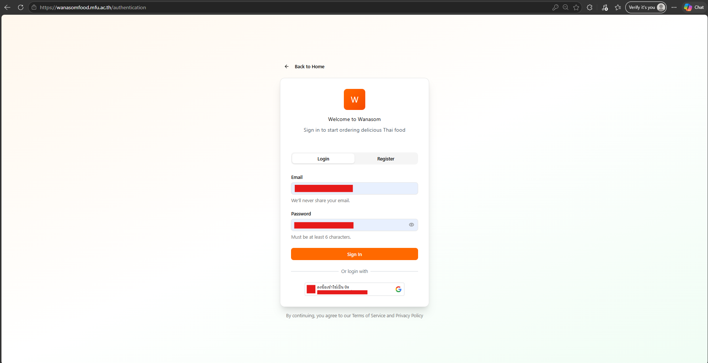
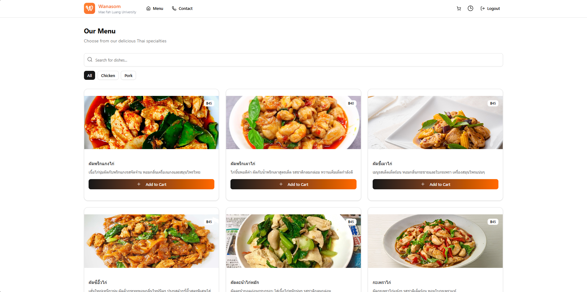
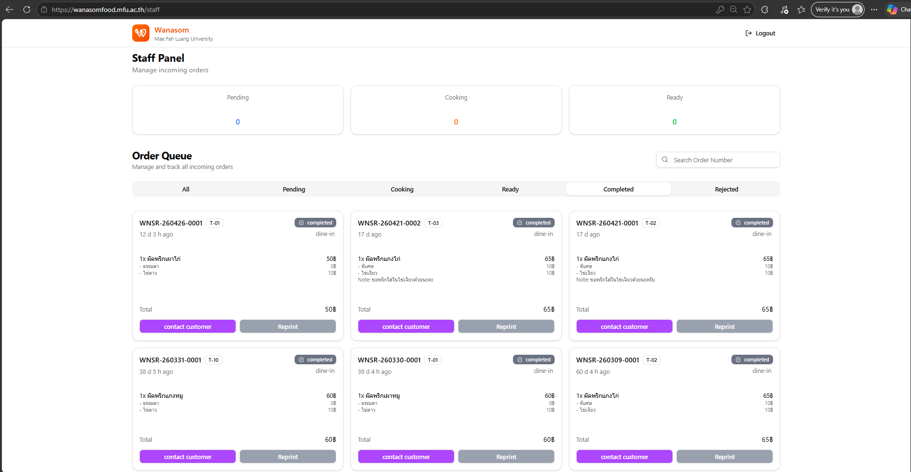
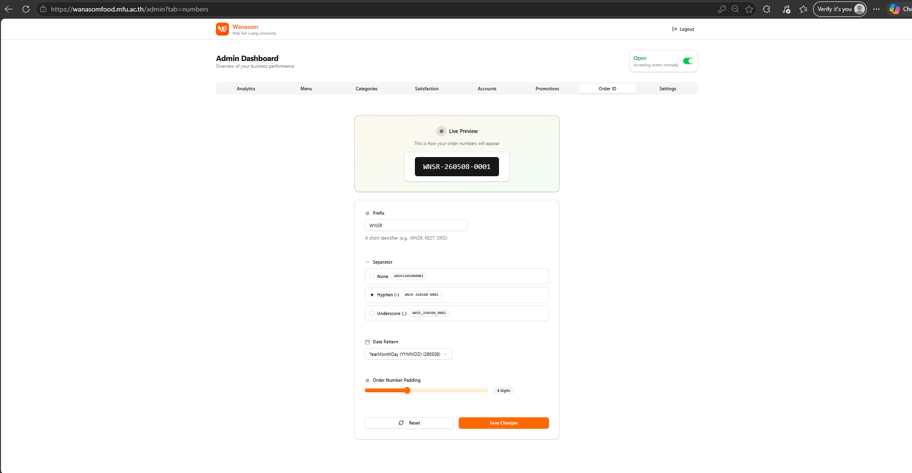

# Wanarom Wanasom Food Ordering System
**ระบบบริหารจัดการและการสั่งอาหาร – ห้องอาหาร วนารมย์ วนาศรม มฟล.**

แพลตฟอร์ม Web Application แบบครบวงจรที่ออกแบบมาเพื่อยกระดับประสบการณ์การสั่งอาหาร ทั้งสำหรับลูกค้าหน้าร้านและออนไลน์ พร้อมระบบบริหารจัดการหลังบ้านสำหรับพนักงานและผู้ดูแลระบบ

---

## Key Features (ฟีเจอร์หลัก)

### 1. Multi-Role User Experience
* **Customer Interface:** ระบบเลือกดูเมนูอาหารแบบแบ่งหมวดหมู่ พร้อมระบบตะกร้าสินค้าและการจัดการที่อยู่จัดส่ง
* **Staff Dashboard:** หน้าจอสำหรับพนักงานเพื่อจัดการคำสั่งซื้อแบบ Real-time อัปเดตสถานะการปรุงอาหาร และตรวจสอบการชำระเงิน
* **Admin Control Panel:** ระบบจัดการสิทธิ์ผู้ใช้งาน, การจัดการเมนู (CRUD), และรายงานสรุปภาพรวม

### 2. Smart Order & Promotion Engine
* **Dynamic Promotion & Coupons:** ระบบสร้างและจัดการคูปองส่วนลดแบบกำหนดเงื่อนไขได้เอง (เช่น ส่วนลดเปอร์เซ็นต์, ยอดขั้นต่ำ)
* **Customizable Order ID:** ระบบเจนเนอเรตรหัสคำสั่งซื้ออัตโนมัติที่สามารถปรับแต่ง Prefix และ Date Pattern ได้ตามความต้องการของฝ่ายบัญชี

### 3. Order Lifecycle Management
* **Real-time Status Updates:** ติดตามสถานะอาหารตั้งแต่ "รับออเดอร์" -> "กำลังปรุง" -> "พร้อมเสิร์ฟ/จัดส่ง"
* **Transaction & Payment:** รองรับการแนบหลักฐานการชำระเงินและระบบตรวจสอบความถูกต้องโดยพนักงาน

### 4. Content Management System (CMS)
* **Landing Page Editor:** ผู้ดูแลระบบสามารถปรับเปลี่ยนรูปภาพแบนเนอร์และเนื้อหา "Why Choose Us" ได้เองผ่านหน้าเว็บโดยไม่ต้องแก้ Code

---

## Tech Stack

* **Frontend:** React.js 
* **Backend:** Node.js
* **Database:** MongoDB
* **Authentication:** OAuth 2.0 (Google Login) & Manual Registration
* **Features:** Live Preview, Image Upload, Role-based Access Control (RBAC)
* **Infrastructure:** Docker Containerization

---

## Engineering Challenges

* **State Management:** การจัดการสถานะออเดอร์ (Order Status) ที่ต้องสอดคล้องกันระหว่างหน้าจอของลูกค้าและห้องเครื่อง
* **Flexible Logic:** การออกแบบระบบคูปองส่วนลดที่มีเงื่อนไขหลากหลาย (Logic Validation) เพื่อให้คำนวณราคาสุทธิได้อย่างแม่นยำ
* **Security:** การคัดกรองสิทธิ์ (Role Filtering) ทันทีหลังการ Login เพื่อนำพาผู้ใช้ไปยัง Interface ที่ถูกต้องตามบทบาท
* **Route Protection:** ระบบป้องกันความปลอดภัยในระดับ Route เพื่อปิดกั้นการเข้าถึงหน้าบ้านและหลังบ้านโดยไม่ได้รับอนุญาต (Unauthorized Access) ป้องกันผู้ไม่ประสงค์ดีเข้าถึงระบบผ่านการระบุ Path โดยตรง

---

## System Demo (วิดีโอสาธิตการใช้งาน)

สามารถรับชมวิดีโอสาธิตการทำงานของระบบแบบเต็มรูปแบบได้ที่ลิงก์ด้านล่างนี้:

📺 **[Watch Demo on YouTube](https://youtu.be/pS8VqLD_hNE?si=G-iwP2LIDIFVm5kL)**

---

## ส่วนการแสดงผลระบบ (System Screenshots)

#### 1. ระบบเข้าใช้งาน (Authentication)
รองรับทั้งการสมัครสมาชิกใหม่ และการ Login ด้วย Google เพื่อความรวดเร็ว

---

#### 2. หน้าเมนูสำหรับลูกค้า (Customer Menu)
Interface ที่เน้นความเรียบง่าย แสดงรูปภาพอาหารและราคาชัดเจน พร้อมระบบตะกร้าสินค้า

---

#### 3. ระบบจัดการคำสั่งซื้อสำหรับพนักงาน (Staff Order Management)
หน้าจอควบคุม Workflow การปรุงอาหารและการตรวจสอบการชำระเงินจากลูกค้า

---

#### 4. ระบบตั้งค่ารหัสคำสั่งซื้อ (Custom Order ID Settings)
ฟีเจอร์ขั้นสูงสำหรับ Admin ในการตั้งค่ารูปแบบรหัสออเดอร์ พร้อมระบบ Live Preview

---

##  Developer
* **Name:** Suphamethee Intharalib, Paramest Suetrong
* **Position:** Full-Stack
* **Project for:** ห้องอาหาร วนารมย์ วนาศรม มหาวิทยาลัยแม่ฟ้าหลวง
